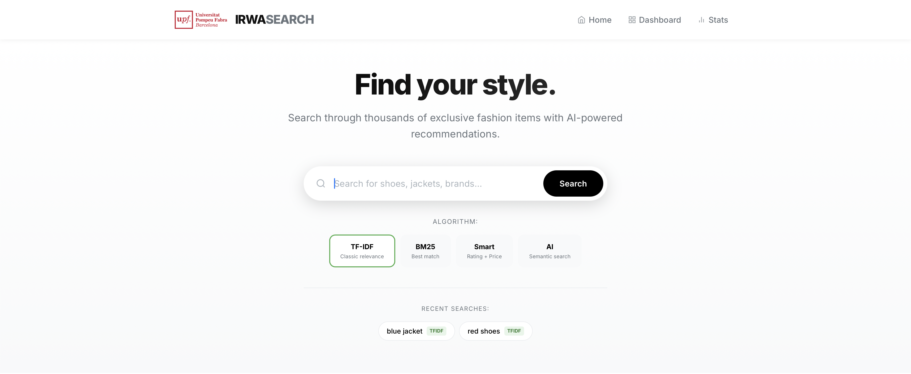

# Information Retrieval and Web Analytics (IRWA) - Search Engine

<table>
  <tr>
    <td style="vertical-align: top;">
      
    </td>
    <td style="vertical-align: top;">
      A Flask web application for searching fashion products with multiple ranking algorithms, RAG-powered recommendations, and web analytics tracking. Built as the final project for the IRWA course.
    </td>
  </tr>
</table>

----
## Features

- **Multiple Search Algorithms**: TF-IDF, BM25, Custom (BM25 + product signals), and Word2Vec semantic search
- **RAG Recommendations**: AI-powered product recommendations using Groq LLM
- **Analytics Dashboard**: Track searches, clicks, and user sessions with visualizations
- **Product Details**: View detailed product information with images, pricing, and ratings

----
## Project Structure

```
/irwa-search-engine
├── myapp/
│   ├── search/              # Search engine and ranking algorithms
│   │   ├── search_engine.py # Main SearchEngine class
│   │   ├── algorithms.py    # TF-IDF, BM25, Custom, Word2Vec rankers
│   │   ├── objects.py       # Document and result models (Pydantic)
│   │   └── load_corpus.py   # Corpus loading utilities
│   ├── preprocessing/       # Text processing
│   │   └── text_processing.py  # Tokenization, stemming, stopwords
│   ├── analytics/           # Web analytics
│   │   ├── analytics_data.py   # Analytics tracking and visualizations
│   │   └── db_manager.py       # SQLite database management
│   ├── generation/          # LLM integration
│   │   └── rag.py           # RAG-based recommendations (Groq)
│   └── core/                # Utilities
│       └── scoring_utils.py # Rating/discount normalization
├── templates/               # Jinja2 HTML templates
├── static/                  # CSS, JS, images
├── data/                    # Dataset and model files (gitignored)
│   ├── fashion_products_dataset.json
│   ├── processed/preprocessed_corpus.pkl
│   └── word2vec_model.bin
├── project_progress/        # Solutions for Parts 1-4
├── web_app.py               # Flask application entry point
├── requirements.txt         # Python dependencies
└── .env                     # Environment variables (gitignored)
```

----
## Setup

### 1. Clone the repository
```bash
git clone <repository-url>
cd irwa-search-engine
```

### 2. Create and activate virtual environment
```bash
virtualenv irwa_venv
source irwa_venv/bin/activate  # Linux/Mac
# or
irwa_venv\Scripts\activate.bat  # Windows
```

### 3. Install dependencies
```bash
pip install -r requirements.txt
```

### 4. Configure environment variables
Create a `.env` file in the project root:
```
GROQ_API_KEY=<your-groq-api-key>
GROQ_MODEL=llama-3.1-8b-instant
DATA_FILE_PATH=data/fashion_products_dataset.json
WORD2VEC_MODEL_PATH=data/word2vec_model.bin
SECRET_KEY=<your-secret-key>
DEBUG=True
```

Get your free Groq API key at [groq.com](https://groq.com/).

### 5. Add data files
Place the following files in the `data/` folder:
- `fashion_products_dataset.json` - Raw product corpus
- `processed/preprocessed_corpus.pkl` - Preprocessed corpus (generated from Part 1)
- `word2vec_model.bin` - Word2Vec embeddings (optional, for semantic search)

----
## Running the Application

```bash
source irwa_venv/bin/activate
python web_app.py
```

The server starts at: [http://localhost:8088](http://localhost:8088)

----
## Search Algorithms

| Algorithm | Description |
|-----------|-------------|
| **TF-IDF** | Classic term frequency-inverse document frequency with cosine similarity |
| **BM25** | Probabilistic ranking with document length normalization |
| **Custom** | BM25 + rating bonus + discount bonus - out-of-stock penalty |
| **Word2Vec** | Semantic search using averaged word embeddings |

All algorithms use conjunctive (AND) query matching: documents must contain all query terms.

----
## Project Parts

- **Part 1**: Text preprocessing - tokenization, stemming, stopword removal
- **Part 2**: Indexing - inverted index construction
- **Part 3**: Ranking - TF-IDF, BM25, custom scoring, evaluation
- **Part 4**: Web application - Flask app with analytics and RAG

Solutions are stored in `project_progress/` folder.

----
## Attribution

Adapted from [IRWA Template 2021](https://github.com/irwa-labs/search-engine-web-app)
